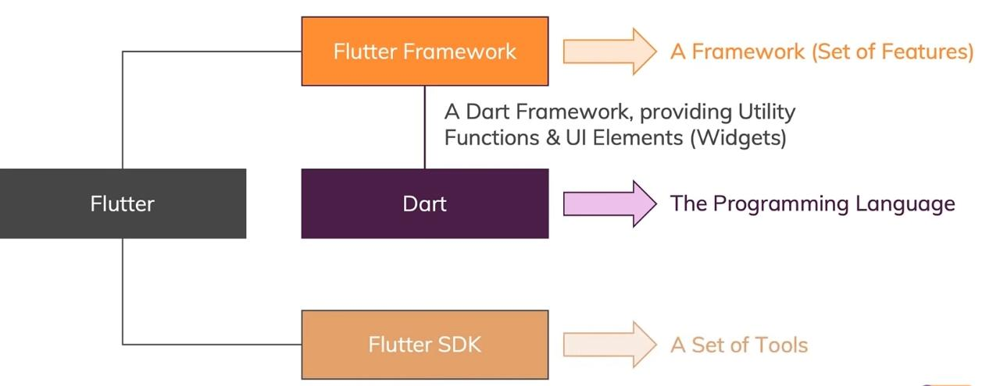
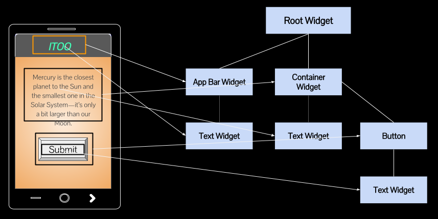
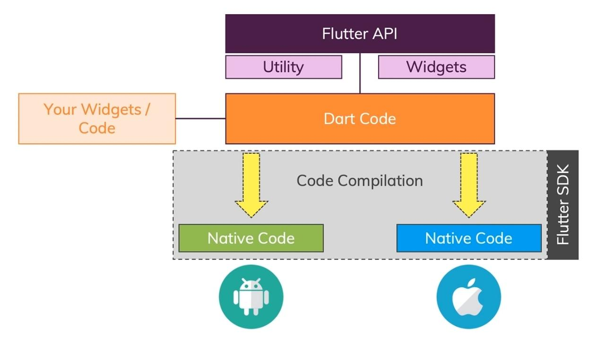

# Flutter and Dart

## What is Flutter ?

A 'tool' that allows you to build **native-cross-platform** (IOS and Android) apps with
**one programming language**(Dart) and codebase.

- Developed By Google.

## What is SDK ?

SDK stands for “Software Development Kit”, which is a great way to think about it — a kit.

A software development kit is a collection of software development tools in one installable package.
They facilitate the creation of applications by having a compiler,
debugger and perhaps a software framework.
They are normally specific to a hardware platform and operating system combination.

## What is API ?

An API is simply an interface that allows software to interact with other software.
This is part of its name — API, Application Programming Interface — and is core to its functionality.

## What is Flutter SDK ?

- Tools to compile our code to native machine code + develop with ease.
- Flutter SDK provides us a Framework/ Widget Library powered by Dart.
- Dart is a programming language which enables the super power in flutter.
- Dart provides Reusable code For UI Building called Widget and Utility functions and Packages.

## What is Dart ?

Dart is a programming language Focused on frontend (mobile apps, web) user interface(UI) development.

- Developed By Google.

- It is an Object oriented and Strongly typed language.
- Syntax is similar to JavaScript or C++.

## Flutter vs Dart



## Flutter Architecture

- Flutter builds UI as Code and build a Widget Tree
- Embrace Platform difference
- One codebase

## What is Widget In Flutter ?

- In flutter Every thing is Widget (a button to whole app)



## UI as Code

- No drag drop
- No visual editor
- Code only
- Once get used too then enjoy code based UI building

## One CodeBase

- Write codes once
  `</>`
- Dart Files

```
- main.dart
- list.dart
- home.dart
```

These file will compile and build for both IOS and Android.

## How Flutter/ Dart "Transformed" to native app ?

- We have a dart code and it uses flutter API
- Flutter API contains Utility and Widgets
- We have our own Widget / Code Too
- Flutter simple compiles our code using
  Flutter SDK such that we have two build app one for IOS and other for Android.
- As a result we get highly optimized high performance code based on Our code.



## Folder Structure

- Idea folder holds some config for android studio
- .vscode is just contains a setting.json files for extensions

- android file contains all the the important file such that we can debug and compile the code.

- build is the resultant or build files

- lib file contains main dart code which contains logic and UI.

- test is a file for testing purpose.

- web is for web view and for web support.

- pubspec.yaml is like package.json because it contains all the list of dependencies and many more about our app .

- pubspec.lock is like package.lock.json file.

# What TODO

### Getting Strted

### Basics

### Debugging

### Widget Styling/ App Logic

### Reaponsive Layout building

### Widget & Flutter Internal

### Navigation

### State Management

### User Input and Forms

### Sending Http requests

### User Authentication

### Animations

### Using Device Features (camera/Maps/compass...)

### Running Native device code

### Publishing an app

### Learn More
